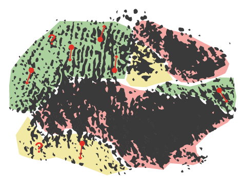

# OpenAFQA

The repository for developing Automated Fingermark Quality Assessment methods.

  

This library is a work in progress. We will update it as we continue our development on the topic. 

## Contents
    
- **[AFQA Toolbox.](afqa_toolbox)** The continuously developed Automated Fingermark Quality Assessment toolbox consists of a collection of commonly used algorithms for friction ridge preprocessing and feature extraction. 
  Also included are Python implementations or wrappers of fingerprint/fingermark quality assessment methods.
- **[Toolbox examples.](toolbox_examples)** Practical examples, where the usage of the toolbox is demonstrated.
- **[Experiments.](experiments)** Code for various publications, related to automated fingermark quality assessment. 

### Toolbox Installation

1. Set up a Python environment by installing packages in requirements.txt
2. To use the minutiae extraction wrappers, download and compile the code. For more information on this, see [minutiae extraction README](afqa_toolbox/minutiae/README.md).
3. The pre-trained models for our quality assessment methods can be downloaded from this [link](https://unilj-my.sharepoint.com/:u:/g/personal/tim_oblak_fri1_uni-lj_si/EWsIr-hK01NJit-NN8XufwIB3uTDYcz4xBjcQ9rYA_rzHA?e=kOWa2n). Either copy the downloaded models into `afqa_toolbox/resources/` or use a custom path at initialization.  
4. The toolbox can be installed locally by running `python setup.py install` or `python setup.py develop` if you want to modify its contents. 

### Latest updates 

- (October, 2022) *The AFQA Ensemble models* - This release includes two approaches to AFQA: (a) a classic predictive pipeline with preprocessing, feature extraction and feature vector creation steps, as well as (b) a deep learning model which processes raw fingermark images. We also include a fusion method that combines multiple quality scores into one. Read more about this contribution in our [Knowledge-Based Systems publication](https://doi.org/10.1016/j.knosys.2022.109148).      
- (September, 2021) *Initial commit* - We released the AFQA toolbox, a collection of algorithms for processing fingerprint/fingermark images, written in Python. We also provided the initial baseline models for quality assessment of fingermarks. Read more about this contribution in our [BIOSIG publication](https://doi.org/10.1109/BIOSIG52210.2021.9548318).     

 
### References
If you use our open-source software, please consider citing: 
    
    T. Oblak, R. Haraksim, P. Peer, L. Beslay. 
    Fingermark quality assessment framework with classic and deep learning ensemble models. 
    Knowledge-Based Systems, Volume 250, 2022    

    T. Oblak, R. Haraksim, L. Beslay, P. Peer. 
    Fingermark Quality Assessment: An Open-Source Toolbox. 
    In proceedings of the International Conference of the Biometrics Special Interest Group (BIOSIG), pp. 159-170, 2021.
     